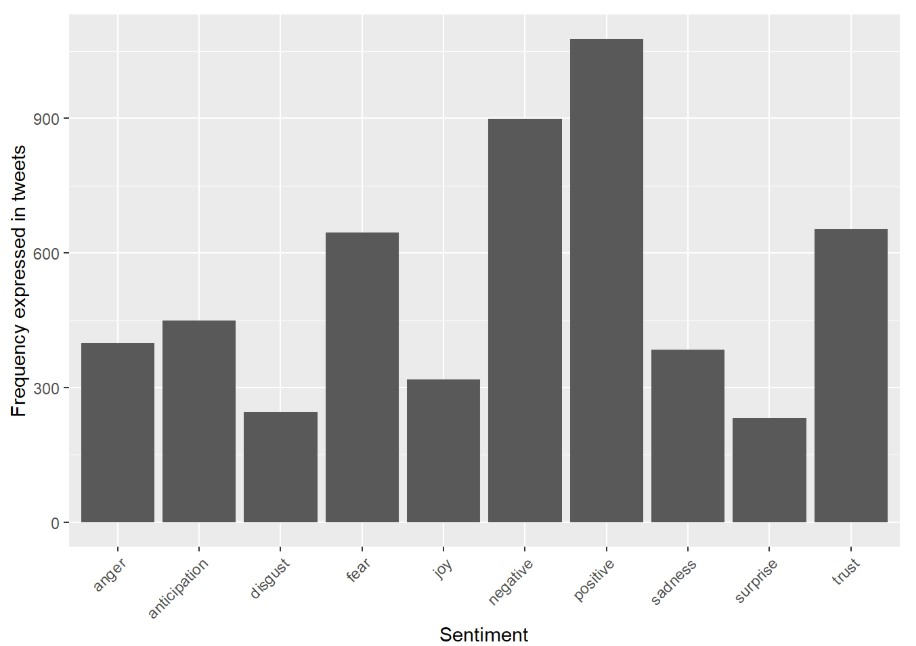

# ClimateAnalysis_TwitterData
Sentiment analysis for data collected from Twitter about climate and COVID-19.

#### Language Used: R

Analysis of the various sentiments occurring in the tweets. Quite interesting to see that there are more positive than negative sentiments. The results also show that along with positive and negative sentiments, other sentiments such as fear, trust, anticipation, anger have also shown up. The tweets have been parsed for only a minute here. The results will vary when the parsing time is changed.

Wordcloud representation of the most commonly occurring words on Twitter about climate and COVID-19. 

